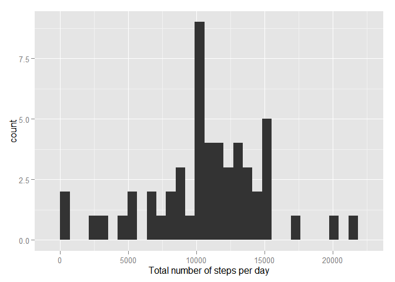
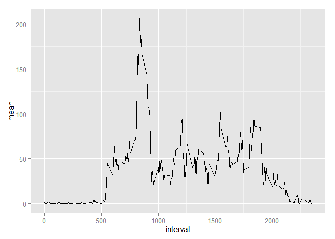
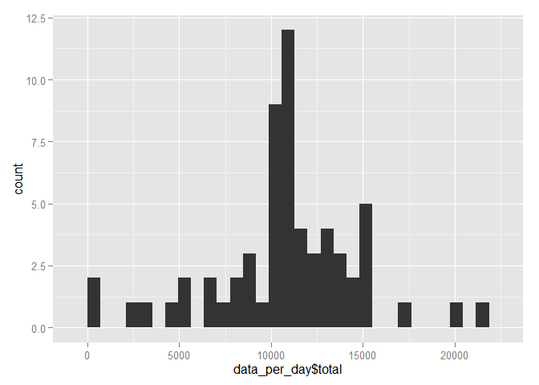
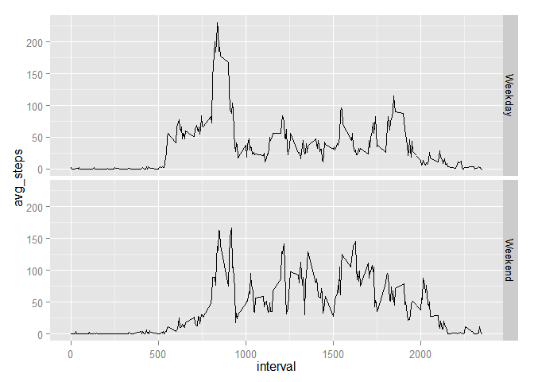

# Reproducible Research: Peer Assessment 1


## Loading and preprocessing the data

Used libraries in this assignment are dplyr and ggplot2.

The data are already included in the repository, we need to unzip the file and load the uncompressed csv file.


```r
library(dplyr)
library(ggplot2)

unzip('activity.zip')
data <- read.csv('activity.csv')
```


## What is mean total number of steps taken per day?

Using dplyr we compute the total number of steps taken per day. We filter out records with missing values.


```r
data_per_day <- data %>%
    filter(!is.na(steps)) %>%
    group_by(date) %>%
    summarise(sum = sum(steps))

qplot(sum, data=data_per_day, xlab = 'Total number of steps per day')
```

 

From summarised data we can compute the mean and median total number of steps per day.


```r
mean(data_per_day$sum)
```

```
## [1] 10766.19
```

```r
median(data_per_day$sum)
```

```
## [1] 10765
```

## What is the average daily activity pattern?

For this task we group the data by interval and then compute average number of steps per interval. Then we can make a time series plot of the average number of steps during the day.


```r
data_per_interval <- data %>%
    filter(!is.na(steps)) %>%
    group_by(interval) %>%
    summarise(mean = mean(steps))

qplot(interval, mean, data = data_per_interval, geom = 'line')
```

 

Let's see which interval on average contains the maximum number of steps.


```r
data_per_interval[which.max(data_per_interval$mean), ]$interval
```

```
## [1] 835
```

## Imputing missing values

First we compute the number of missing values.


```r
sum(is.na(data$steps))
```

```
## [1] 2304
```

Missing values will be replaced by the average number of steps for that interval.


```r
no_na_data <- merge(data, data_per_interval)
missing.values <- which(is.na(no_na_data$steps))
no_na_data[missing.values, 'steps'] <- no_na_data[missing.values, 'mean']
no_na_data <- no_na_data %>% select(steps, date, interval)
```

Now we can make a histogram again and compute mean and median.


```r
data_per_day <- no_na_data %>% group_by(date) %>% summarise(total = sum(steps))
qplot(data_per_day$total)
```

 

```r
mean(data_per_day$total)
```

```
## [1] 10766.19
```

```r
median(data_per_day$total)
```

```
## [1] 10766.19
```

We can see that the mean is the same, but the median is now equal to the mean. That's because there was a day when all intervals had missing values. By replacing those NAs with average for interval, we created a day with total  steps equal to the average value.

## Are there differences in activity patterns between weekdays and weekends?

We need to add a new column indicating if the date is a weekday or a weekend.
Then we can summarise the data accordingly and plot them.


```r
no_na_data$weekday <- weekdays(as.Date(no_na_data$date))
no_na_data$weekend <- factor(no_na_data$weekday == 'Saturday' | no_na_data$weekday == 'Sunday', labels = c("Weekday", "Weekend"))
weekday_data <- no_na_data %>%
    group_by(weekend, interval) %>%
    summarise(avg_steps = mean(steps))
ggplot(weekday_data, aes(interval, avg_steps)) + geom_line() + facet_grid(weekend ~ .)
```

 

One thing we can notice from the plot is that people are more active early in the morning during the weekdays.
